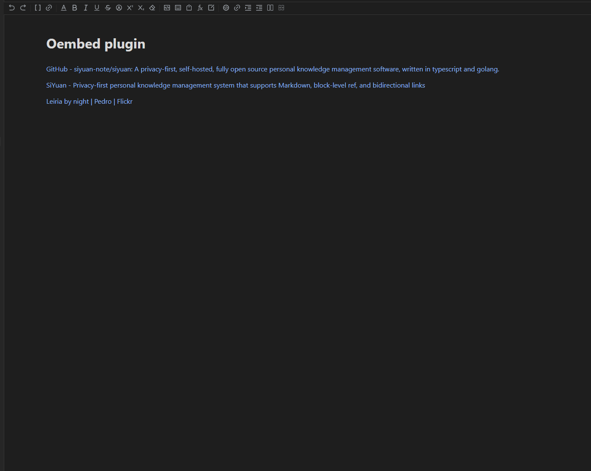

 
<em>SiYuan Oembed and Ghost-style bookmark cards</em>
  

 

 

 

<a href="README.md">English</a> | <a href="README_pl_PL.md">Polish</a> | <a href="README_zh_CN.md">简体中文</a>

## ✨ Opis wtyczki

Wtyczka ma dwie główne funkcjonalności:

1. Pozwala na konwersję linków (URL) do ich osadzonej reprezentacji zgodnie z formatem [Oembed](https://oembed.com/). Gdy dana strona to obsługuje, link może zostać przekonwertowany bezpośrednio na zdjęcie, wideo lub inny format udostępniany przez stronę.

2. Pozwala na konwersję linków (URL) do eleganckiej karty zakładki bazującej na [kartach zakładek](https://ghost.org/help/cards/#bookmark) z [Ghost CMS](https://ghost.org/). Wykorzystałem implementację z mojego motywu [Astro Simply](https://github.com/anarion80/astro-simply).

Obie funkcjonalności są od siebie niezależne, więc możesz konwertować albo do oembed, albo do karty zakładki.

Działa to tak:

> :exclamation:
> Niestety, osadzenia z X.com (dawniej Twitter) są oparte na skryptach i nie udało mi się jeszcze ustalić, dlaczego skrypt nie jest wykonywany pomimo włączonego wykonywania skryptów w ustawieniach (zobacz: [mój post na Liuyun.io](https://liuyun.io/article/1729866570402)) :exclamation:
>
> Facebook/Instagram wymaga klucza API (API_KEY) do osadzania ich treści, więc też raczej nie działa.

Z powyższych powodów oembed ma trochę ograniczoną użyteczność i być może będę musiał dodać osobną konwersję dla tweetów.

## 🖱 Użytkowanie

Wtyczka oferuje trzy sposoby konwersji linków:

1. Komendy ukośnika (slash) z przypisanymi skrótami klawiszowymi:
   - `/oembed`, `/Oembed`, `/oe`, `Ctrl`+`Shift`+`O` dla konwersji Oembed
   - `/card`, `/bookmark`, `/bk`, `Ctrl`+`Shift`+`C` dla konwersji do karty zakładki
  

2. Menu ikony bloku po zaznaczeniu jednego lub więcej bloków:
  

3. Osobne ikony na pasku narzędzi:
  

> :exclamation:
> Obie konwersje działają jako przełącznik. Uruchomienie akcji raz konwertuje link do oembed lub karty zakładki. Uruchomienie jej drugi raz przywraca zwykły link.

## ⚙ Ustawienia

Wtyczka posiada kilka ustawień konfiguracyjnych:

| Ustawienie | Wyjaśnienie |
| ---: | ----------- |
|`Przechwytuj linki ze schowka`|Automatycznie przekształcaj linki wklejane ze schowka na oembed lub kartę zakładki (:exclamation: Jeszcze nie zaimplementowane!)|
|`Wybierz typ konwersji przy wklejaniu`|Jaki typ konwersji zastosować automatycznie podczas wklejania linku ze schowka (:exclamation: Jeszcze nie zaimplementowane!)|
|`Włącz debugowanie`|Włącz szczegółowe debugowanie, aby pomóc w rozwiązywaniu problemów|
|`Lista blokowanych domen` dla oembed|Lista domen do pominięcia przy konwersji (jedna na linię) ( Jeszcze nie zaimplementowane!)|
|`Lista blokowanych domen` dla kart zakładek|Lista domen do pominięcia przy konwersji (jedna na linię) (Jeszcze nie zaimplementowane!)|
|`Własny CSS dla kart zakładek`|Możliwość wprowadzenia własnego CSS do stylizacji kart zakładek. Można stylizować wszystkie klasy `kg-card-*` i `kg-bookmark-*`.|

## ⌛ Problemy i ograniczenia

Obecnie wtyczka używa [openGraphScraperLite](https://github.com/jshemas/openGraphScraperLite) do pobierania metadanych Open Graph i Twitter. Jest to jedyne narzędzie, które znalazłem, które daje się zbundlować z wtyczką bez problemów. Powoduje to również duży rozmiar wtyczki (ponad 3MB). [Metascraper](https://github.com/microlinkhq/metascraper) jest znacznie lepszy, ale niestety nie działa w środowisku klienckim wtyczki.

Inną opcją byłoby użycie [API Microlink](https://api.microlink.io) do pobierania metadanych linków, ale jest to ograniczone do 50 zapytań/dzień w darmowym planie.

Kolejnym ograniczeniem jest już wspomniany brak osadzeń Facebook/Instagram przez oembed oraz brak wykonywania skryptów do zapewnienia właściwego CSS dla X.com (Twitter).

## 🙏 Podziękowania

- [SiYuan](https://github.com/siyuan-note/siyuan) za użyteczne narzędzie jakim jest SiYuan. Użyłem niektórych ich funkcji bezpośrednio, ponieważ nie były dostępne przez API.
- [Przykład wtyczki SiYuan z vite i svelte](https://github.com/siyuan-note/plugin-sample-vite-svelte) - bardzo przydatna baza dla developmentu wtyczek.
- [Zuoqiu-Yingyi i siyuan-packages-monorepo](https://github.com/Zuoqiu-Yingyi/siyuan-packages-monorepo).
- [Przewodnik rozwoju wtyczek SiYuan](https://docs.siyuan-note.club/en/guide/plugin/sy-plugin-dev-quick-start.html?utm_source=liuyun.io) - bardzo przydatne wprowadzenie do developmentu wtyczek.
- [Zuoez02 i plugin-card-link](https://github.com/zuoez02/siyuan-plugin-card-link).
- [Frostime i siyuan-dailynote-today](https://github.com/frostime/siyuan-dailynote-today).
- [Hqweay i siyuan-hqweay-go](https://github.com/hqweay/siyuan-hqweay-go).
